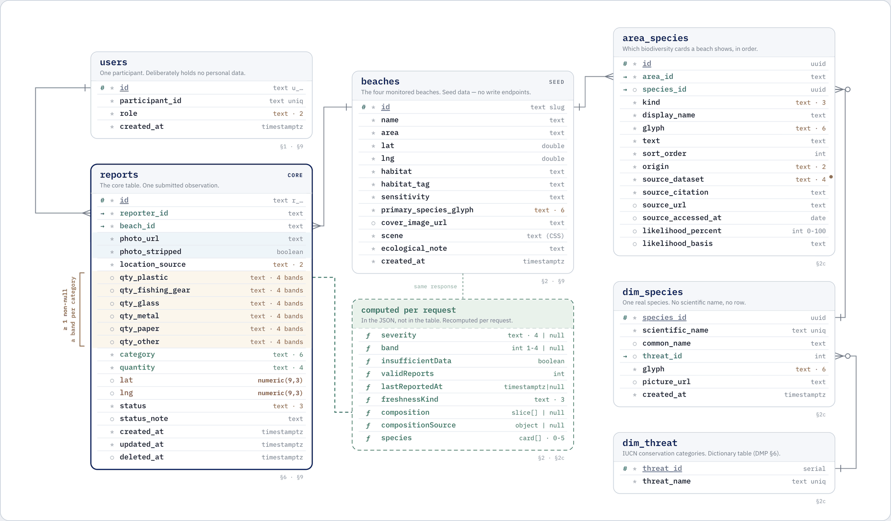

# Radar Sampah — 后端接口规范 v1（Iteration 1）

> **本文是中文版。** 同一份契约有三份，内容一致，改一份要三份都改：
>
> | 文件 | 语言 | 给谁 |
> | --- | --- | --- |
> | [`API.md`](./API.md) ← 你在看这份 | 中文 | Qian Jiang（前端） |
> | [`API.en.md`](./API.en.md) | English | LiHanXia（后端）、Keith（数据库） |
> | [`openapi.yaml`](./openapi.yaml) | English | 工具 —— Swagger UI、生成服务端骨架 |

> **这份文档是接口契约，不是需求讨论稿。** 前端已经完整实现并按这套契约跑通，
> 后端照着实现即可。所有原先待定的点都已定稿，理由写在每节的「定稿理由」里 ——
> 后端如果有实现上的困难要改，改之前先说，前端跟着调 `src/api.ts` 一处即可。
>
> 机器可读版本：[`openapi.yaml`](./openapi.yaml)（可直接导入 Swagger UI / 用来生成
> 服务端骨架）。
> 数据治理依据：[Data Management Plan](../docs/DATA_MANAGEMENT_PLAN.md)（[.docx 原件](../docs/RadarSampah_Data_Management_Plan_Iteration1_MVP.docx)）。

---

## 0. 通用约定

> ✅ **`actual-project/backend/app.py` 已实现本契约。** 早期的 `/api/*` 识别、
> 热力图和清理任务路由不再是 Iteration 1 的活动接口。契约覆盖测试位于
> `backend/tests/test_api.py`。

| 项 | 约定 |
| --- | --- |
| 协议 | HTTPS，JSON（除照片上传是 `multipart/form-data`） |
| 编码 | UTF-8 |
| 时间 | 一律 ISO 8601 带时区，例 `2026-08-25T09:41:00+08:00`。**业务上的「同一天」按 `Asia/Kuala_Lumpur` 判定** |
| 鉴权 | `Authorization: Bearer <token>`，登录后由前端存 localStorage |
| 分页 | Iteration 1 不做。四个海滩、单人记录量级很小，一次返回全量 |

### 错误格式

任何非 2xx 一律返回：

```json
{ "code": "PHOTO_TOO_LARGE", "message": "Photo exceeds the 10 MB limit." }
```

`message` 是**给用户看的英文成句**，前端直接展示，不做二次拼装。

| HTTP | code | 触发场景 |
| --- | --- | --- |
| 400 | `VALIDATION_FAILED` | 必填字段缺失或值不在枚举内 |
| 400 | `PHOTO_REQUIRED` | 提交记录时没带 `photoKey` |
| 400 | `PHOTO_TOO_LARGE` | 照片超过 10 MB |
| 400 | `PHOTO_UNSUPPORTED_TYPE` | 不是 JPEG / PNG / HEIC |
| 401 | `UNAUTHENTICATED` | token 缺失、过期或无效 |
| 403 | `NOT_OWNER` | 改/删别人的记录 |
| 404 | `NOT_FOUND` | 海滩或记录不存在 |
| 404 | `UNKNOWN_PARTICIPANT` | 输入的编号不存在 |
| 413 | `PAYLOAD_TOO_LARGE` | 上传体积超限（服务器层拦截） |
| 429 | `RATE_LIMITED` | 见 §8 |
| 500 | `INTERNAL_ERROR` | 兜底 |

> ⚠️ **提交重复记录不是错误。** 返回 `201` + `status: "Duplicate"`，前端要正常
> 显示「已保存但不计入」，而不是报错。详见 §6。

---

## 1. 认证 —— 匿名参与者编号

**团队决议：Iteration 1 不收集任何真实个人数据。** 没有姓名、没有邮箱、没有密码。
用户领一个 4 位编号（例如 `1637`），记录就挂在这个编号下面。

| 方法 | 路径 | 鉴权 | 说明 |
| --- | --- | --- | --- |
| POST | `/auth/anonymous` | 否 | 发一个新编号 |
| POST | `/auth/restore` | 否 | 用已有编号继续 |
| POST | `/auth/logout` | 是 | 返回 204 |
| GET | `/auth/me` | 是 | |

**POST `/auth/anonymous`**（无请求体）

```json
// 201
{
  "token": "eyJhbGciOi...",
  "user": { "id": "u_01H...", "participantId": "1637", "role": "volunteer" }
}
```

**POST `/auth/restore`**

```json
// 请求
{ "participantId": "1637" }
// 200 —— 同上
```

**GET `/auth/me`** 返回 `user`；token 无效返回 401。

- `participantId`：4 位数字，随机生成，不重复
- `role`：Iteration 1 只用 `"volunteer"`，`"moderator"` 是给后面迭代留的
- token 用 JWT 就行，有效期给长一点（30 天），不用做 refresh

> **一句话提醒（不影响本次开发）**：编号本身就是凭证，所以任何人输入 `1637`
> 都能看到 1637 的记录。这次是 MVP、数据是合成的，够用。
> 如果以后要收真实投稿，这一层需要加密码 —— 到时候再说，现在不做。

## 2. 海滩

| 方法 | 路径 | 鉴权 | 说明 |
| --- | --- | --- | --- |
| GET | `/beaches` | 否 | 地图和列表用 |
| GET | `/beaches/:id` | 否 | 详情 |

**不需要登录** —— 设计稿里「Browsing needs no account」是明确承诺。

### GET `/beaches` → `BeachSummary[]`

```json
[{
  "id": "morib",
  "name": "Pantai Morib",
  "area": "Banting, Selangor",
  "lat": 2.746,
  "lng": 101.440,

  "severity": "High",
  "band": 3,
  "insufficientData": false,
  "validReports": 8,
  "lastReportedAt": "2026-08-19T16:00:00+08:00",
  "freshnessKind": "ok",

  "habitat": "Intertidal mudflat & sandy shore",
  "habitatTag": "MUDFLAT",
  "sensitivity": "Migratory feeding ground",
  "primarySpeciesGlyph": "turtle",
  "speciesNames": ["Green Sea Turtle", "Mangrove Fringe", "Coastal Birds"],

  "coverImageUrl": "https://cdn.example.com/beaches/morib.jpg",
  "scene": "linear-gradient(178deg,#8FD0E8 0%,#4E9EC9 36%,#2E6EA8 58%,#173E77 100%)"
}]
```

| 字段 | 类型 | 说明 |
| --- | --- | --- |
| `severity` | `"Low"｜"Moderate"｜"High"｜"Severe"｜null` | **有效记录 < 3 条时必须是 `null`**，不要给 `"Low"` 兜底 |
| `band` | `1｜2｜3｜4｜null` | 和 `severity` 一一对应，同时为 null。前端画那 4 根竖条用它 |
| `insufficientData` | boolean | `severity === null` 时为 true |
| `validReports` | int | **只数 `Counted` 的**，Duplicate / Incomplete 不算 |
| `lastReportedAt` | string｜null | 最近一条 **Counted** 记录的时间。前端自己算「几天前」，后端不要给现成文案 |
| `freshnessKind` | `"ok"｜"aging"｜"stale"` | < 30 天 / 30–90 天 / > 90 天或从无记录 |
| `primarySpeciesGlyph` | `"turtle"｜"bird"｜"mangrove"｜"grass"｜"crab"｜"fish"` | 生物图层的地图标记图标 |
| `speciesNames` | string[] | 这片海滩生物卡片的名字，按 `sort_order`。地图的生物图层直接显示它们 —— 不然图层上只有生境，看不到任何一个物种。只要名字，完整卡片仍在 `BeachDetail.species` |
| `coverImageUrl` | string｜null | 真实封面照片。**没配图就给 `null`**，前端会退回 `scene` 渐变 |
| `scene` | string | 一段合法 CSS `background` 值，作为无图时的占位。种子数据里已有，原样存原样下发 |

### GET `/beaches/:id` → `BeachDetail`

在 `BeachSummary` 基础上多三个字段：

```json
{
  "composition": [
    { "category": "Plastic", "quantity": "Large" },
    { "category": "Fishing gear", "quantity": "Medium" }
  ],
  "compositionSource": { "reportId": "r_01H...", "createdAt": "2026-08-19T16:00:00+08:00" },
  "species": [{
    "name": "Green Sea Turtle",
    "glyph": "turtle",
    "text": "Occasional visitor along the Strait of Malacca. Floating plastic may be mistaken for food.",
    "source": "DoF Malaysia · 2024"
  }],
  "ecologicalNote": "Plastic and abandoned fishing gear may affect turtles and shorebirds that feed in this coastal environment."
}
```

- `composition`：该海滩**最新一条 `Counted` 记录**的非空类别列，按类别权重降序。
  它**不是**聚合值，也和 `insufficientData` 无关，详见 §2b。
  **该海滩一条 `Counted` 记录都没有时返回 `null`**，不要返回空数组。
- `compositionSource`：成分取自哪一条记录。`composition` 非空时必填，界面上要印它的日期。
- `species`：静态科普数据，人工维护，不随记录变。0–5 条。
- `ecologicalNote`：一句话，静态。

**定稿理由：`severity` / `band` / `validReports` / `composition` 全部由后端算好下发，
前端不碰计算。** 产品对用户的核心承诺是「同一套规则跑所有海滩」（评分说明页整页都在
讲这件事），规则必须只有一个实现、在服务端、可审计。前端重算等于第二个实现。

---

## 2b. 生物出现分数（Epic 5 · Su）

> ⚠️ **这不是「出现概率」。** Su 确认过：Iteration 1 的模型只用了 OBIS 的出现记录、
> 生成的背景点和经纬度，输出的是**相对出现分数**，没有经过校准。
> 所以界面上不能显示成百分号，文案里也不能说「有多大可能出现在这里」。
> 原来卡片上那两个百分比（绿海龟 38%、海岸鸟类 76%）已经全部撤掉。

模型目前覆盖四个物种：**绿海龟、公子小丑鱼、伊洛瓦底海豚、镰鳍角蝶鱼**。
不在这四个里的卡片（比如「海岸鸟类」这种统称）**不会有分数**，这一版也不会有。

```json
{
  "name": "Green Sea Turtle",
  "kind": "species",
  "scientificName": "Chelonia mydas",
  "glyph": "turtle",
  "text": "Occasional visitor along the Strait of Malacca…",
  "source": { "dataset": "OBIS", "citation": "…", "url": "…", "accessedAt": "2026-08-20" },
  "likelihood": {
    "state": "ready",
    "score": 38,
    "basis": "Coordinate model over OBIS occurrence records and background samples."
  }
}
```

### `state` 有三个值，界面上分三种说法

| state | 什么意思 | 界面显示 |
| --- | --- | --- |
| `ready` | 模型接上了，`score` 有值 | 分数 + `RELATIVE OCCURRENCE SCORE · NOT A PROBABILITY` |
| `pending` | 这个物种在覆盖范围内，但后端还没接上 | `OCCURRENCE MODEL · RESULT PENDING` |
| `unavailable` | 这个物种不在那四个里 | `OCCURRENCE MODEL · NO DATA FOR THIS CARD` |

**`pending` 和 `unavailable` 必须分开**：一个是「还没做」，一个是「做不了」。
混成一句话，用户会以为再等等就有了。

- `score`：0–100 的整数，**相对分数不是概率**。只在 `state = 'ready'` 时给。
- `basis`：这个数怎么来的，一句话，**界面上原样显示**，不能留空。
- `likelihood` 整个省略 → 前端退回纯科普展示，什么都不显示。

### 三条硬约束（前端已经这样实现了）

1. **绝不和垃圾严重度合并成一个数。** 两者是完全不同的东西，混在一起用户必然误读。
2. **视觉上必须区分。** 前端刻意没用严重度那套四色，用的是琥珀色虚线框。
3. **文案不能说成概率。** 海滩页的免责声明现在是：
   「…reports a relative occurrence score, built from OBIS records and background samples at
   coordinate level. It is not a calibrated probability of presence…」
   评分说明页那句「No model, no judgement call」只限定在**垃圾严重度**上。

> 这三条不是洁癖 —— 产品对用户的核心承诺就是「数据可信、规则透明」。
> 一个说成概率的相对分数，会把 Epic 4 辛苦建立的可信度一起赔进去。

**待 Su 确认**：`basis` 要不要带模型版本号？有没有置信区间要展示？
定了前端跟着调，改动只在 `types.ts` 一处。

## 2c. 生物数据的出处（DMP §2 / §9 强制）

DMP 的来源登记表只认两个开放数据集，两个都是 **CC BY-NC —— 仅限非商业使用**，
并且**要求署名必须显示在界面上**、源 URL 和访问日期必须保留（DMP §9）。

所以出处是**数据的一部分**，不是注释：

```json
{
  "name": "Green Sea Turtle",
  "kind": "species",
  "scientificName": "Chelonia mydas",
  "threatCategory": null,
  "glyph": "turtle",
  "text": "Occasional visitor along the Strait of Malacca…",
  "pictureUrl": null,
  "source": {
    "dataset": "OBIS",
    "citation": "OBIS — Ocean Biodiversity Information System. Intergovernmental Oceanographic Commission of UNESCO. www.obis.org — CC BY-NC",
    "url": "https://api.obis.org/occurrence",
    "accessedAt": "2026-08-28"
  }
}
```

- `kind`：`species` / `habitat` / `group`。**只有 `species` 才可能有学名和受威胁等级** ——
  生境（红树、海草）和统称（候鸟、海洋鱼类）没有
- `threatCategory`：来自 FishBase 抽取。**没拉到就是 `null`，不要猜**
- `source.dataset`：`FishBase` / `OBIS` / `other` / `pending`
- `pictureUrl`：FishBase 的 `picture_url`。**图片版权独立于数据集**，用前要逐张确认

### ⚠️ 现在这 11 张卡片的出处全是占位

前端 `src/mockData.ts` 里 11 条物种数据的 source 一律是 `PENDING_SOURCE`，
界面上显示成琥珀色角标 `SOURCE PENDING · NOT YET FROM FISHBASE / OBIS`。
这是故意的 —— **宁可露出来，也不能让一条编造的引用混进演示或报告里**。

### ⚠️ 11 张里只有 1 张能真正来自 FishBase

| 卡片类型 | 张数 | FishBase | OBIS |
| --- | --- | --- | --- |
| 鱼类统称（Marine Fish） | 1 | ✓ | ✓ |
| 海龟、鲎 | 2 | ✗ 只收鱼 | ✓ |
| 红树、海草（生境） | 5 | ✗ | ✗ |
| 候鸟、海岸鸟类 | 3 | ✗ | ✗ |

**7 张在这两个库里都不存在。** FishBase 只收鱼，OBIS 收海洋类群但不含陆生鸟类和
植物生境。这几张要么换成别的有署名的来源（用 `dataset: "other"`），
要么改成不需要物种级出处的写法。**这件事 Su 和 Keith 要一起定**，
因为它同时影响 Epic 5 的内容和 DMP §2 的来源登记表。

### 物种存储：`dim_species` + `area_species`（已定）

物种主记录和「这片区域展示哪些卡片」拆开。原来的 `beach_species` 被这两张表取代。

```sql
-- FishBase 抽取出来的物种主表。DMP §4.1：按 scientific_name upsert
CREATE TABLE dim_threat (
  threat_id     serial PRIMARY KEY,
  threat_name   text NOT NULL UNIQUE          -- 受威胁等级字典
);

CREATE TABLE dim_species (
  species_id      uuid PRIMARY KEY,
  scientific_name text NOT NULL UNIQUE,       -- ← upsert 键。没有学名的行直接丢弃
  common_name     text,
  threat_id       int  REFERENCES dim_threat(threat_id),
  glyph           text NOT NULL,              -- 六个图标枚举之一
  picture_url     text,                       -- 图片版权独立，用前逐张确认
  created_at      timestamptz NOT NULL DEFAULT now()
);

-- 「这片区域的生物多样性卡片」。areas 1 ─ N area_species ─ N…1 dim_species
CREATE TABLE area_species (
  id                  uuid PRIMARY KEY,
  area_id             text NOT NULL REFERENCES beaches(id) ON DELETE CASCADE,
  species_id          uuid NULL REFERENCES dim_species(species_id),

  kind                text NOT NULL CHECK (kind IN ('species','habitat','group')),
  display_name        text NOT NULL,
  glyph               text NOT NULL,          -- 六个图标枚举之一。必须在这里：
                                              -- 生境和统称没有 dim_species 行，
                                              -- 图标也无法从 kind 推出来
                                              -- （group 里既有 bird 又有 fish）
  text                text NOT NULL,
  sort_order          int  NOT NULL DEFAULT 0,
  origin              text NOT NULL DEFAULT 'curated'
                           CHECK (origin IN ('curated','derived')),

  source_dataset      text NOT NULL,
  source_citation     text NOT NULL,
  source_url          text,
  source_accessed_at  date,

  occurrence_state    text NOT NULL DEFAULT 'unavailable'
                           CHECK (occurrence_state IN ('ready','pending','unavailable')),
  occurrence_score    int  CHECK (occurrence_score BETWEEN 0 AND 100),
                           -- 相对出现分数，不是概率。只有 state='ready' 时有值
  occurrence_basis    text,

  UNIQUE (area_id, species_id),
  CHECK ((kind = 'species') = (species_id IS NOT NULL)),
  CHECK ((occurrence_score IS NULL) = (occurrence_state <> 'ready')),
  CHECK ((occurrence_score IS NULL) OR (occurrence_basis IS NOT NULL))
);
```

**`species_id` 可空是关键。** 11 张卡里只有 2 张是真物种（Green Sea Turtle、Horseshoe Crab），
另外 9 张是生境（红树、海草）和统称（海岸鸟类、候鸟、海洋鱼类）——
它们没有学名，按 DMP §4.1「Rows without a usable scientific name are discarded」
根本进不了 `dim_species`。可空外键让这 9 张卡活在 `area_species` 自己的行上，
`dim_species` 保持纯粹来自 FishBase。

**为什么 `text` 在 junction 上而不在 `dim_species` 上。** 同名卡片在不同海滩的文案是不同的：
`Coastal Birds` 在 Morib 是「Migratory shorebirds feed along this tide line…」，
在 Kelanang 是「Egrets and herons hunt along the shallow channels…」。
`likelihood_*` 同理 —— 它本来就是「物种 × 地点」的值。

**两个 CHECK 是防呆的。** `kind='species'` 必须挂主记录、反之不许挂；
likelihood 两列必须同生同死。

**API 响应形状不变。** 后端把两张表 join 之后拍平成现在的 `species[]` 数组，
前端一行代码都不用改。

> **两处待办**：
> ① 表里写的是 `area_id REFERENCES beaches(id)` —— DMP 管这个概念叫 `areas`，
>   契约叫 `beaches`。同一个东西两个名字，改名是单独一步，不在这次改动里。
> ② `origin` 默认 `curated`。接上 OBIS 之后，落在区域地理框内的 occurrence
>   可以自动生成 `derived` 行，那时不用改表结构。

---


### 一条记录记六个类别：`reports` 加六列（已定）

原来一条记录只有一个 `category` + 一个 `quantity`。改成六个类别各一列，
一次上报可以描述一堆混合垃圾。

```sql
ALTER TABLE reports
  ADD COLUMN qty_plastic      text CHECK (qty_plastic      IN ('Small','Medium','Large','Very Large')),
  ADD COLUMN qty_fishing_gear text CHECK (qty_fishing_gear IN ('Small','Medium','Large','Very Large')),
  ADD COLUMN qty_glass        text CHECK (qty_glass        IN ('Small','Medium','Large','Very Large')),
  ADD COLUMN qty_metal        text CHECK (qty_metal        IN ('Small','Medium','Large','Very Large')),
  ADD COLUMN qty_paper        text CHECK (qty_paper        IN ('Small','Medium','Large','Very Large')),
  ADD COLUMN qty_other        text CHECK (qty_other        IN ('Small','Medium','Large','Very Large')),

  -- 至少要记一个类别，否则这条记录没有内容
  ADD CONSTRAINT reports_at_least_one_category CHECK (
    num_nonnulls(qty_plastic, qty_fishing_gear, qty_glass,
                 qty_metal, qty_paper, qty_other) >= 1
  );
```

**`NULL` = 这次没看到这个类别**，不是「看到了但数量为零」。这两件事在界面上要区分开：
没勾的类别不画条，不是画一根长度为 0 的条。

**老的 `category` / `quantity` 两列变成派生值**，保留是为了不破坏现有响应：

```
category  = 六列里权重最高的那个非空类别
            （权重见 §3：Fishing gear 1.00 > Plastic 0.85 > Glass 0.70
              > Metal 0.60 > Other 0.50 > Paper 0.35）
quantity  = 该类别对应那列的值
```

等记录页改成多选、前端不再读这两列之后，可以整个删掉。

### 「Learn More」显示最新一条记录的成分（已定）

生物图层地图卡片上的 **Learn More** 和垃圾图层的 **View Beach** 去的是同一个地方 ——
海滩详情页。那一页的「LITTER COMPOSITION」区块，语义改成：

> **该海滩最新一条 `Counted` 记录的六列成分**，而不是 90 天窗口内的聚合。

`GET /beaches/:id` 的 `composition` 相应改成：

```json
"composition": [
  { "category": "Plastic",      "quantity": "Large"  },
  { "category": "Fishing gear", "quantity": "Medium" },
  { "category": "Glass",        "quantity": "Small"  }
],
"compositionSource": {
  "reportId":  "r_01H...",
  "createdAt": "2026-08-19T16:00:00+08:00"
}
```

- 只列**非空**的类别，按权重降序
- `compositionSource` 是必需的 —— 界面上原来那行
  `SHARE OF 8 VERIFIED REPORTS · BROAD CATEGORIES` 现在是**假的**，
  必须换成「来自 8 月 19 日那条记录」之类的说法，否则就是在骗用户
- 该海滩一条 `Counted` 记录都没有时，`composition` 和 `compositionSource` 都返回 `null`

> ⚠️ **这条改动让 `area_garbage` 失去意义。** 那张表是把「N 条记录按类别的占比」
> 物化下来；现在成分只取最新一条记录，直接从 `reports` 那一行读就行，
> 不需要聚合表。**不建 `area_garbage`（已定）。**

### 这个改动还牵动三处

| 位置 | 现状 | 要改成 |
| --- | --- | --- |
| `RecordScreen.tsx` | 类别单选（`patchDraft({ category: cat })`） | 六个类别各自能选一个数量档，可多选 |
| 严重度公式（§7） | `类别权重 × 数量档`，一条记录一个值 | 一条记录有多个类别，要定清楚是取最大值、求和还是求平均 |
| `BeachScreen.tsx` 那行说明 | `SHARE OF n VERIFIED REPORTS` | 改成指向具体某条记录的日期 |

**第二条必须由 Darli 定**，因为它直接改变地图上每个海滩的等级。在定下来之前，
后端算严重度可以先按「取六列里权重最高的那个类别」跑，这和现在的单类别行为完全一致。

---

## 3. 评分规则（US4.3）　— 这个接口是**可选的**

| 方法 | 路径 | 鉴权 | 说明 |
| --- | --- | --- | --- |
| GET | `/scoring-method` | 否 | **可选**，不实现也不影响前端 |

**团队决议：US4.3 为 non-blocking stretch，规则由前端交付。** 权重、阈值、窗口
都写死在前端 `src/scoring.ts`，评分说明页直出，离线也能看，不依赖后端。

```json
{
  "categoryWeights": [
    { "category": "Fishing gear", "weight": 1.00 },
    { "category": "Plastic",      "weight": 0.85 },
    { "category": "Glass",        "weight": 0.70 },
    { "category": "Metal",        "weight": 0.60 },
    { "category": "Other",        "weight": 0.50 },
    { "category": "Paper",        "weight": 0.35 }
  ],
  "quantityWeights": [
    { "quantity": "Small",      "weight": 1 },
    { "quantity": "Medium",     "weight": 2 },
    { "quantity": "Large",      "weight": 3 },
    { "quantity": "Very Large", "weight": 4 }
  ],
  "bands": [
    { "band": "Low",      "range": "below 1.5",     "color": "#7CA98B" },
    { "band": "Moderate", "range": "1.5 – 2.4",     "color": "#D9A24B" },
    { "band": "High",     "range": "2.5 – 3.4",     "color": "#CE6B45" },
    { "band": "Severe",   "range": "3.5 and above", "color": "#B84A3F" }
  ],
  "windowDays": 90,
  "minReports": 3
}
```

### ⚠️ 后端不实现这个接口也可以，但**必须用上面这组数字**

严重度是后端算的（§7），公布的规则是前端展示的。两边用的数字必须一模一样 ——
否则页面上写着「Plastic 0.85」，后端却按 0.9 在算，那 US4.3 的整个意义就没了。

- 上面这组数字是**规范**，`src/scoring.ts` 是它的可执行副本
- 后端如果实现了这个接口且返回值不同，前端会**以后端为准**（那才是真正在算的
  规则），并在开发模式下 console 告警指出哪个数字对不上
- 要改任何一个权重或阈值，两边同时改，并升 `RULE_VERSION`

## 4. 定位 → 海滩

| 方法 | 路径 | 鉴权 | 说明 |
| --- | --- | --- | --- |
| POST | `/geo/resolve-beach` | 是 | |

```json
// 请求
{ "lat": 2.7461, "lng": 101.4402 }
// 200 —— 命中，返回一个 BeachSummary
// 200 —— 未命中，返回 null（不是 404）
```

规则：
- 用半正矢距离找最近的海滩，**距离 ≤ 25 km 才算命中**，否则返回 `null`
- **这个坐标一律不落库。** 只在这个请求里算一次，算完丢掉

**定稿理由：25 km。** 四个海滩彼此最近的一对（Morib ↔ Kelanang）相距约 6 km，
25 km 既能把它们区分开，又能容忍手机定位在海边的漂移。真的不在这四个海滩附近时
返回 `null`，前端会转到手选。

---

## 5. 照片上传

**照片不进数据库，也不建 `photos` 表。**
字节放对象存储（或磁盘），**存储位置在公开 Web 根目录之外**，`reports` 上只留一个存储键。
对齐 DMP §5：`Object storage or server filesystem outside public web root; references in DB only.
Access controlled.`

| 方法 | 路径 | 鉴权 | 说明 |
| --- | --- | --- | --- |
| POST | `/uploads/photos` | 是 | `multipart/form-data`，字段名 `photo` |

```json
// 201
{
  "photoKey": "2026/08/8f3a....jpg",
  "metadataStripped": true
}
```

记录上就三列：

```sql
ALTER TABLE reports
  ADD COLUMN photo_key      text    NOT NULL,   -- 存储里的键，不是可访问地址
  ADD COLUMN photo_stripped boolean NOT NULL,
  ADD COLUMN photo_mime     text    NOT NULL CHECK (photo_mime IN ('image/jpeg','image/png'));
```

`POST /reports` 带的是 `photoKey`（上一步返回的那个）。

### 访问控制：只有拍照片的人能看到它

**上报照片从来只给它自己的作者看。** 前端只有三处会渲染照片，全都是本人的记录：
`ReviewScreen`（自己正在提交的草稿）、`RecordScreen`（同上）、`MyReportsScreen`（我的记录）。
没有任何公开接口会下发别人的照片 —— 海滩详情页用的是 `beaches.cover_image_url`（海滩自己的
封面图，种子数据），和上报照片是两回事。

所以规则很简单：

- 存储桶/目录**不可公开读**。没有任何一个长期有效的公开地址。
- `GET /reports/mine` 和 `POST` / `PATCH /reports` 的响应里，`photoUrl` 是一个
  **短时效签名地址**（建议 15 分钟），由后端在序列化时按 `photo_key` 现场签发。
- **签发前先校验归属**：`report.reporter_id` 必须等于当前 token 的用户。不是本人就不签，
  直接不返回 `photoUrl` 字段。
- 签名地址过期后自然失效。前端不缓存它 —— 每次拿列表都会拿到新的。

`` 标签带不了 Authorization 头，所以这里用签名地址而不是「带 token 的接口」。
这是对象存储的标准做法（S3 presigned URL / GCS signed URL），不是变通。

> ⚠️ **EXIF 剥离和不可枚举的文件名不能替代访问控制。**
> 它们防的是「照片泄露位置」和「有人猜地址」，防不了「地址被转发出去」。
> 真正的控制是：桶不公开 + 归属校验 + 短时效。三者缺一不可。

### 后端必须做的三件事

1. **剥离 EXIF**，尤其 GPS 段。剥干净了才返回 `metadataStripped: true`，
   并写进 `reports.photo_stripped` —— 前端靠它显示
   「LOCATION METADATA REMOVED」那条角标。
   **剥不干净就返回 `false`，不要撒谎**，那是一句对用户的承诺。
2. **限制**：≤ 10 MB；收 `image/jpeg`、`image/png`、`image/heic`（iOS 直出是 HEIC，
   必须收，服务端转成 JPEG）；长边压到 ≤ 2048 px。
3. **清理孤儿**：上传后 24 小时内没有任何记录引用的文件，定时任务删掉。
   字节在库外，所以这个清理必须自己做 —— 外键帮不上忙。

> ⚠️ **库里存的只是一个键，不是图。** 存储里的文件被删掉之后，
> `photo_key` 会指向空处，数据库这边不会有任何察觉。
> 删记录的时候要顺手删文件，反过来也一样。

---

## 6. 记录 ★ 核心

| 方法 | 路径 | 鉴权 | 说明 |
| --- | --- | --- | --- |
| POST | `/reports` | 是 | 提交 |
| GET | `/reports/mine?status=` | 是 | 我的记录，按时间倒序 |
| GET | `/reports/mine/counts` | 是 | 三个计数 |
| PATCH | `/reports/:id` | 是 | 修正 |

### POST `/reports`

```json
// 请求
{
  "beachId": "morib",
  "quantities": {
    "Plastic": "Large",
    "Fishing gear": "Medium",
    "Glass": "Small"
  },
  "photoKey": "2026/08/8f3a....jpg",
  "locationSource": "gps",
  "coords": { "lat": 2.746, "lng": 101.440 }
}
```

- **`quantities` 是一个对象，不是数组**：键是类别原文（`Plastic` / `Fishing gear` /
  `Glass` / `Metal` / `Paper` / `Other`），值是四个数量档之一。
  **至少一项**，没看到的类别就不出现在对象里 —— 不要传 `null`，也不要传 0。
  后端把它映射到 `reports` 的 `qty_*` 六列，没出现的列写 `NULL`。
- **请求里不再有 `category` / `quantity`。** 这两个是派生值，由后端从 `quantities` 里
  取权重最高的那个非空类别算出来（见 §2c），响应里照常返回。
- **响应里必须同时带回完整的 `quantities`。** 只给派生的那一对是不够的：
  前端的「改正记录」会拿响应回填表单，再整体 PATCH 回来。如果响应里只有一个类别，
  用户只是换张照片，另外五列就会被清空 —— 这是个会真的丢数据的坑。
- `locationSource`：`"gps"`（由定位推断）或 `"manual"`（用户手选）
- `coords`：**仅 `locationSource === "gps"` 时携带**。见下方隐私要求

```json
// 201
{
  "id": "r_01H...",
  "beachId": "morib",
  "beachName": "Pantai Morib",
  "quantities": {
    "Plastic": "Large",
    "Fishing gear": "Medium",
    "Glass": "Small"
  },
  "category": "Fishing gear",
  "quantity": "Medium",
  "createdAt": "2026-08-25T09:41:00+08:00",
  "status": "Counted",
  "photoUrl": "https://cdn.example.com/photos/ph_01H....jpg"
}
```

被判重复时：

```json
{
  "id": "r_01H...",
  "status": "Duplicate",
  "statusNote": "Matched an existing record for the same beach on the same day — excluded from the severity calculation.",
  "...": "其余字段同上"
}
```

### 状态判定 —— 同步，在 POST 的事务里完成

**定稿理由：同步。** 设计稿里提交完直接进「Record saved」页，页面上就印着
「VALID · NOT A DUPLICATE · COUNTED」这个结论。要做成异步审核，就得多一个 Pending
状态和一整套通知，那是 Iteration 2 的审核流程（明确不在本次范围）。

判定顺序，命中即停：

| 顺序 | 条件 | 结果 |
| --- | --- | --- |
| 1 | `photoKey` 缺失 | 400 `PHOTO_REQUIRED`，不入库 |
| 2 | `quantities` 为空对象，或键/值不在枚举内 | 400 `VALIDATION_FAILED`，不入库 |
| 3 | 同一 **reporter** + 同一 **beachId** + 同一 **自然日**（`Asia/Kuala_Lumpur`）已有 `Counted` 记录 | `Duplicate` |
| 4 | 其余 | `Counted` |

**`Duplicate` 的定义就是这一条，不要再加坐标距离判断。** 设计稿里那句提示
（「Matched an existing record for the same beach on the same day」）就是这个规则的
自然语言版，二者必须一致。同一天同一海滩多拍几张不同角度，本来也不该重复计分。

**`Incomplete` 怎么产生的？** 不由 POST 产生 —— POST 阶段缺字段直接 400 挡回去了。
`Incomplete` 是**事后**变成的，只有两个来源：

- 照片处理管线事后判定不可读（全黑 / 全糊 / 解码失败），把已有记录改成 `Incomplete`
- Iteration 2 的人工审核（本次不实现，先留状态值）

所以 Iteration 1 里 `Incomplete` 只会出现在种子数据和照片管线里。前端已经支持：
点这条记录会带着原值进「修正」流程，改完走 PATCH。

### `statusNote`

**由后端下发英文成句，前端原样显示，不做拼装。** 两句标准文案：

- Duplicate → `Matched an existing record for the same beach on the same day — excluded from the severity calculation.`
- Incomplete → `Photo unreadable — excluded until you correct and save the record.`

`Counted` 时**不要**返回这个字段（或给 `null`）。

### 位置怎么存（已定）

坐标**存在 `reports` 表自己的行上**（`lat` / `lng`，可空），不再单独开表。
对齐 DMP §6 的 `litter_reports: photo ref, approx location, category, quantity, status…`。

- 只在 `locationSource = 'gps'` 时写入；手选海滩时两列为空
- 用途只有两个：匹配海滩、查重
- **精度：小数点后 3 位（约 110 m）**。前端在 `GpsScreen` 采集处就取整，
  精确值从头到尾没离开过设备 —— 这样 DMP 的 `no exact locations are stored`
  和界面上的「EXACT GPS IS PRIVATE」才都成立

### 隐私要求（硬要求）

- **任何对外接口都不得返回 `lat` / `lng`**，包括记录详情、我的记录列表、CSV 导出、管理后台
- 公开数据的地理粒度只到 `beachId`

> ⚠️ **坐标现在和业务字段同表，`SELECT *` 会带出来。**
> 请在 ORM/序列化层显式排除这两列，并在 code review 里当固定检查项。

界面上有两处白纸黑字的承诺撑着这条：确认页的「GPS USED ONCE · PRIVATE」，
和地图卡片的「BROAD AREA SHOWN — EXACT GPS IS PRIVATE」。

### GET `/reports/mine?status=`

`status` 可选，取值 `Counted` / `Duplicate` / `Incomplete`；不传返回全部。
**按 `createdAt` 倒序。** 只返回当前登录用户自己的记录。

### GET `/reports/mine/counts`

```json
{ "counted": 3, "duplicate": 1, "incomplete": 1 }
```

### PATCH `/reports/:id`

请求体是 POST 请求体的任意子集（`beachId` / `quantities` / `photoKey`）。
**给了 `quantities` 就是整体替换**，不是逐键合并 —— 少传一个类别就等于把那一列清空。

- 只能改自己的记录，否则 403 `NOT_OWNER`
- **改完要重跑一遍状态判定**：一条 `Incomplete` 记录补好照片后应该变回 `Counted`
- 返回更新后的完整 `LitterReport`

---

## 7. 严重度怎么算（后端实现细节）

```
对某个海滩：

eligible = 该海滩所有 status = 'Counted' 且 created_at 在最近 90 天内的记录

if count(eligible) < 3:
    severity = null;  band = null;  insufficientData = true
else:
    record_score  = category_weight[category] × quantity_weight[quantity]
                    ← 一条记录有多个类别时取哪一个：见下面的「待定」
    beach_score   = mean(record_score for eligible)
    severity      = < 1.5 → Low | < 2.5 → Moderate | < 3.5 → High | else Severe
    band          = Low=1, Moderate=2, High=3, Severe=4

validReports    = count(eligible)
lastReportedAt  = max(created_at) over 该海滩所有 Counted 记录（不限 90 天窗口）
freshnessKind   = now - lastReportedAt: < 30d → 'ok' | ≤ 90d → 'aging' | else 'stale'

composition       = 该海滩最新一条 Counted 记录的非空 qty_* 列，按类别权重降序
compositionSource = 那条记录的 { reportId, createdAt }
                    两者在该海滩一条 Counted 记录都没有时都是 null
                    ← 注意：composition 不看 90 天窗口，也不受 insufficientData 影响
```

注意 `lastReportedAt` **不受 90 天窗口限制** —— 「Not recently reported」这个提示
本身就是要告诉用户「最近一条也已经很旧了」，窗口内没数据不等于从来没数据。

实现方式随意：写时更新缓存列，或读时实时算（四个海滩的量级，实时算完全够）。

**`category_weight` / `quantity_weight` / 阈值一律取 §3 那组数字**，不要另立一套。

> ⚠️ **待定：一条记录有多个类别时，`record_score` 怎么算？**
> 六列里可能有好几个非空，取最大值、求和还是求平均，直接改变地图上每个海滩的等级。
> **这一条由 Hnin Darli 定。** 在定下来之前，按「取权重最高的那个非空类别及其数量档」
> 计算 —— 这和改成六列之前的单类别行为完全一致，不会让现有数字跳变。
>
> `DECISIONS.md` 2026-08-19 那条写的是「quantity-band midpoint × category weight，
> 再乘 recency 和 area sensitivity（1.0 / 1.25 / 1.5）」，和上面这个公式不是一回事。
> 而且 area sensitivity 就是把生物敏感度并进垃圾严重度，§2b 明确说了不能这么做。
> **两份文件必须有一份改。**

---

## 8. 限流

按用户：`POST /reports` 每小时 30 条，`POST /uploads/photos` 每小时 60 张。
超了返回 429 `RATE_LIMITED`。

---

## 9. 数据表建议




```
users            id, participant_id(uniq), role, created_at
                 ← 没有姓名、邮箱、手机号等任何个人数据字段
beaches          id, name, area, lat, lng, habitat, habitat_tag, sensitivity,
                 primary_species_glyph, cover_image_url, scene,
                 ecological_note, created_at
dim_threat       threat_id(PK), threat_name(uniq)          ← DMP §6 字典表
dim_species      species_id(PK), scientific_name(uniq), common_name,
                 threat_id(FK), glyph, picture_url, created_at
                 ← 只放有学名的真物种，按 scientific_name upsert
area_species     id(PK), area_id(FK→beaches), species_id(FK→dim_species, nullable),
                 kind, display_name, glyph, text, sort_order, origin,
                 source_dataset, source_citation, source_url, source_accessed_at,
                 occurrence_state, occurrence_score(nullable), occurrence_basis(nullable)
                 ← 分数是相对值不是概率；state 区分「还没接」和「没有数据」
                 ← 区域×物种的 junction；生境和统称的 species_id 为空
reports          id, reporter_id, beach_id, location_source,
                 photo_key, photo_mime, photo_stripped
                 ← 不建 photos 表，字节也不进库。存的是存储键，不是可访问地址；
                   响应里的 photoUrl 是按归属校验后现签的短时效地址（§5）
                 qty_plastic, qty_fishing_gear, qty_glass,
                 qty_metal, qty_paper, qty_other        ← 每列可空，至少一列非空
                 category, quantity                     ← 派生：权重最高的非空类别
                 lat(nullable), lng(nullable),
                 status, status_note, created_at, updated_at, deleted_at
                 ← lat/lng 只在 gps 来源时写入，存到小数点后 3 位，
                   绝不出现在任何响应里（序列化层显式排除）
```

`beaches` 和 `area_species` 是**种子数据**，Iteration 1 固定四个海滩，
没有增删改接口。种子内容照抄前端 `src/mockData.ts`，字段名一一对应。

---

## 10. 不在 Iteration 1 范围（不要实现）

设计稿明确标了 out of scope，接口也就没留：AI 分类建议（US2.3）、同伴与管理员
审核流程、Epic 1 活动、Epic 6 成果、Epic 7 周期性、Epic 8 荣誉体系、
US5.3 测验、US5.4 物种卡片。

---

## 11. 后端做完怎么联调

```bash
cd radar-sampah-web
cp .env.example .env
# .env 里填 VITE_API_BASE_URL=https://your-api.example.com
npm run dev
```

前端会自动从 mock 切到真实 HTTP，页面代码不用改。字段或路径对不上时，改动集中在
`src/api.ts`。
