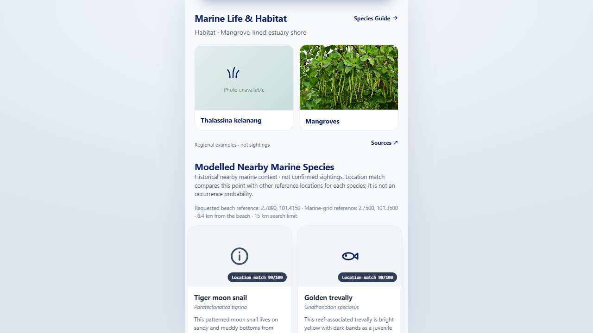
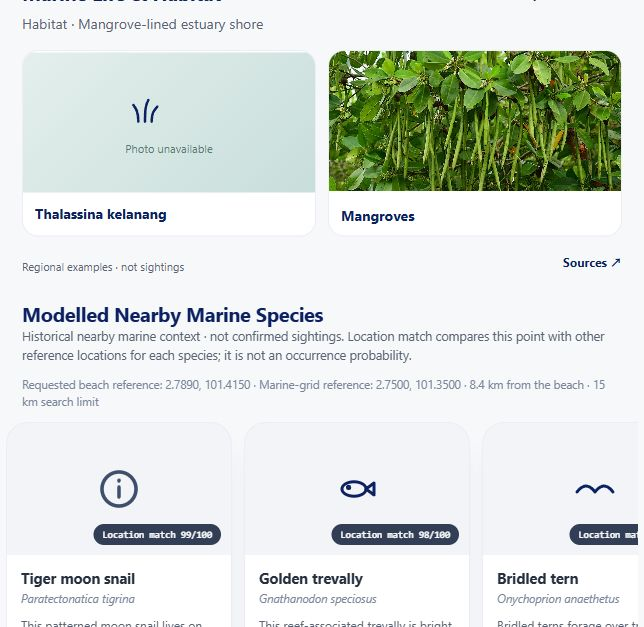
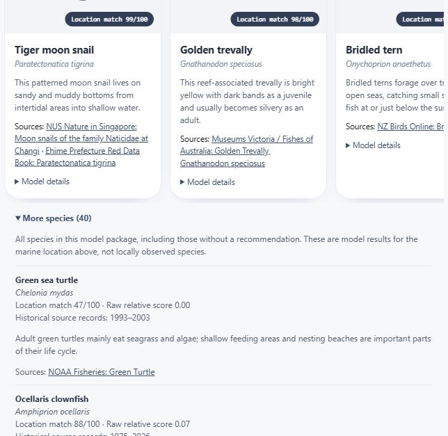
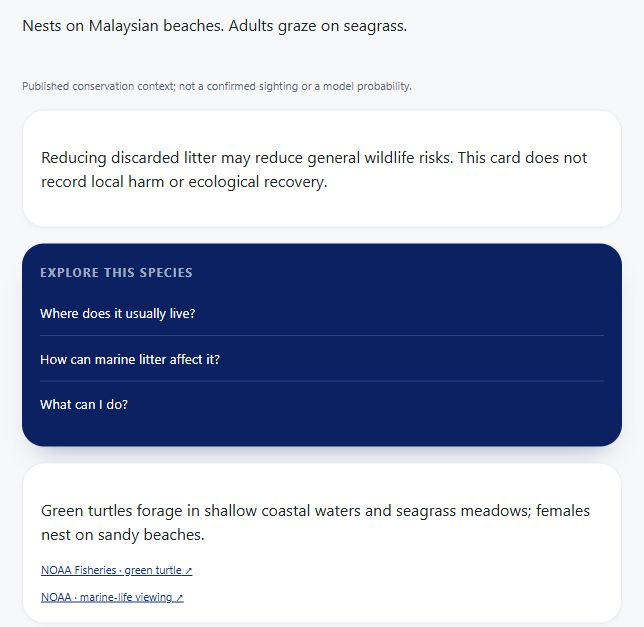

# Iteration 3: 40-species model integration test report

Date: 6 October 2026 (Asia/Seoul).

## Scope and upstream delivery

The model source is [iteration3-model-upgrade](https://github.com/huangguan-giegie/radar_sampah/tree/iteration3-model-upgrade)
at `0397c82f557638a799c377dd6718cf8f4a420604`, model version
`iteration3-upgrade-40-species-20261003`. Before this integration, the website
served the earlier four-model package. The independent branch is imported into
the existing backend package, preserving its weights, training inputs,
inference and provenance without replacing the website deployment configuration.

The API now exposes the 40-species catalog and all 40 scores, with optional
Top-K suggestions. Exact mode preserves the supplied point; explicit nearby
mode selects a frozen marine-grid centre within a fixed 15 km limit and reports
the original point, used point, grid identity and distance. The actual
`/beach/:beachId` route renders `CoastalBeachScreen`, which displays Top 5 and an
expandable all-40 list. Four approved conservation cards and their prepared
questions remain separate from the model catalog.

## Pre-release verification

| Round | Result | Coverage |
| --- | --- | --- |
| Upstream artifacts | Passed | Exactly 40 actual weights; every SHA matches the upstream manifest and validation record. Direct inference matches the 4,227-by-40 saved grid scores. |
| First integrated API focus | 87 passed in 102.28 s | Catalog, score identities, direct/nearby semantics, Top-K, validation and existing API contracts. |
| Final focused regression | 52 passed in 58.71 s | Model upgrade, marine area gate, approved wildlife cards/questions and complete Iteration 3 journeys. |
| Integrated iteration3 retest | 52 passed in 67.79 s | Repeated focused journeys after PR #60 merged; the released tree matches the tested feature tree exactly. |
| Complete backend regression | **275 passed in 255.70 s** | All backend tests, including privacy, reference migrations, evidence, contributions, cleanup, recurrence and existing litter model contracts. |
| First frontend regression | 238 passed in 37 files, 4.61 s; build passed | API options, score semantics, card renderer and existing frontend journeys. Actual browser testing subsequently identified the routed-page omission described below. |
| Final actual-route frontend regression | **243 passed in 38 files, 4.74 s; TypeScript and Vite build passed, 547 ms** | Production CoastalBeachScreen, shared card renderer, all-40 inspection, loading/errors, null coordinates, stale requests, source links and existing screens. |
| Complete local runtime | Passed | Actual ONNX litter detector loaded and returned ready; 40-species registry loaded once; all 56 located beach records returned valid nearby context. |
| Frozen training preparation | Passed | All 157 original training candidates prepared offline; 151 animals and six seagrasses. Serving weights were not retrained. |
| Staged-tree package verification | Passed | Extracted Git index tree, rather than relying on working files; all five input/reference fingerprints verified, 40 weights complete, direct and saved scores consistent. |
| Actual local browser | Passed; console warnings/errors empty | Real routed Kelanang page shows the marine-grid reference, 8.4 km displacement, recommended new species, introductions/sources and More species (40). |

The complete runtime probe used Python 3.12.10 on Windows, the installed website
backend dependencies and real ONNX weights. Cold startup was **10.96 s**;
resident memory after detector inference and 56 nearby predictions was
**401.63 MiB**, peak **406.21 MiB**. These are local measurements, distinct from
Render/Linux capacity. The existing one-worker deployment configuration is retained.

The catalogue contains 86 beaches: 82 export entries and four core beaches.
All **56 located records** (52 export plus four core) returned 40 rows within the
15 km limit. The other **30 export entries remain unlocated**; the frontend
skips inference and explains that coordinates are needed. The coordinate
sources are documented separately in [52-coordinate source register](beach-coordinate-sources-52.md).

## Failures found and corrected

- The initial pytest invocation could not use Windows' shared temporary test
  directory. Tests were rerun with a fresh workspace-local temporary directory.
- Two old shoreline tests expected silent tolerance in exact mode. The new
  model correctly rejects Kelanang's land-side point. Tests and the real beach
  request now require explicit nearby mode and verify disclosed displacement.
- The first frontend work targeted the legacy BeachScreen. Real browser
  inspection exposed that App routes to CoastalBeachScreen. A shared model
  component was connected to that actual route, with route/component regression
  tests and a second full frontend run.
- The first actual-route build used a Node filesystem import in a browser test
  without Node types. It was replaced by the existing Vite raw-source import;
  the complete frontend suite and production build were rerun successfully.
- The first memory-probe output used an incorrectly typed Windows process
  handle. The probe was corrected and rerun with the real detector loaded.
- Git's newline conversion initially changed a frozen EEZ input in the staged
  tree, although working-directory package verification passed. Byte-preserving
  attributes and explicit re-normalisation preserve the upstream bytes;
  verification of an extracted staged snapshot subsequently passed.

## Interpretation and limits

Raw relative-occurrence scores are uncalibrated historical model scores.
Location match is a within-species reference percentile. Cross-species Top-5
accuracy, current beach sightings and ecological abundance have not been
independently validated. The UI identifies these limits and retains all raw
scores for inspection.

The package has no photographs. The website uses its four existing licensed
images by exact scientific identity and neutral category icons for other
species. Insights uses the returned percentile order but only links to the
four approved conservation cards, preventing missing new-species answer pages.
Model calls do not write coordinates/results or affect litter severity. Local
fixtures establish database independence; production tests create no public
reports, joins, attendance or cleanups.

## Actual local screenshots

Captured from the running website and backend on 6 October 2026; these are
pre-release local evidence, not deployed-site screenshots. The viewport shows
the first visible cards/list rows; the DOM and API checks establish all 40 rows.

## Merge and deployment verification

Implementation [PR #60](https://github.com/huangguan-giegie/radar_sampah/pull/60)
merged into iteration3 as `cd4e29c53b2c6edffadb79b744e3f0568e940edb`.
Release [PR #61](https://github.com/huangguan-giegie/radar_sampah/pull/61)
merged into main as `1fd13e06819973002ceebd30d861d4eb06c5238c`.
The feature, integrated and released Git trees are identical:
`59846cee0fa08c032a2b477951e0975566ee8bf9`.
The prior main version is preserved by
`release/pre-40-species-integration-20261006` at
`53ab5df7c0a14d7b5d2a205795d8e2546bf8c3da`.

Both existing Render services are **live** on the release commit:

| Service | Deployment | Finished (Asia/Seoul) |
| --- | --- | --- |
| Backend | `dep-db24oarl550s73c1qu8g` | 6 October 2026, 10:20:46 (`2026-10-06T01:20:46Z`) |
| Frontend | `dep-db24oarl550s73c1qud0` | 6 October 2026, 10:18:01 (`2026-10-06T01:18:01Z`) |

### Live automated checks

**183 API requests completed with their expected statuses** in two smoke suites:

- **98 model and conservation requests** verified the complete live registry and
  catalog; all 56 located beaches returned exactly 40 scores, each raw score
  and percentile independently matching the frozen matrix at the disclosed
  grid cell. Checks included default strict coordinates, explicit nearby mode,
  Top-K options, rejected invalid inputs/search-limit overrides, 400/422
  responses, wildlife panel links and all 12 prepared answers.
- **85 integrated requests** covered all 52 export points resolving to their own
  stable IDs, public Insights privacy, recommendations, profile update and
  restore, opt-out leaderboard behaviour, private history, rejected
  cross-owner access, CORS and live frontend bundles. This includes an actual
  ephemeral cleanup-photo request to the existing ONNX detector: it returned
  HTTP 200 and `state: empty` for a blank fixture, with the expected
  `sea-taco-yolo11m-best-onnx/1` version. Empty means inference ran but found no
  supported litter; it was not unavailable. The photo was not stored.

The integration smoke used a new opted-out participant, cleared its temporary
nickname and added no public reports, joins, attendance or cleanup evidence.
The model suite used public reads and non-persisting prediction/prepared-answer
requests. The live dataset still contains 82 export entries, 52 located export
points, 30 null pairs and four separate core beaches.

Browser checks on the deployed URL confirmed the actual route, new-species
Top 5, expanded all-40 list, source links, explicit 8.4 km Kelanang marine-grid
reference and working green-turtle conservation answer. Browser warning/error
logs were empty. Render application-error logs were empty for the queried
`01:20:46–01:25:53 UTC` release window.

### Dated follow-up observation

At `2026-10-06 01:37:29 UTC` (`10:37:29` Asia/Seoul), one read-only public
`/insights/participation` request returned HTTP 500 while the event-scheduler
beach-summary query was running. The psycopg error was
`SSL connection has been closed unexpectedly`; no write mutation occurred.
The immediately following single recheck returned HTTP 200 for
`/insights/participation`, `/insights/summary`, `/insights/cleanup` and
`/health`. Logs were checked through `01:37:31 UTC`. This is one recovered
transient observation, distinct from the original 183 successful checks, and
was not reproduced as an outage.

Render one-minute memory samples for the new instance
`srv-d9v00r3ncjis73amjvi0-r65vz` ranged from 387,907,600 to 498,249,730 bytes
(approximately **369.94–475.17 MiB**) during release verification, below the
reported approximately **512 MiB** limit. These samples do not establish
stress-load capacity; they include real serving and the litter inference check.

### Actual deployed screenshots

Captured on 6 October 2026 from
[the live Kelanang beach page](https://team04-marine-observation-frontend.onrender.com/beach/kelanang).
The visible subset of cards reflects the current viewport; API and DOM checks
verify the full registry. The two earlier screenshots above are explicitly
local; the following three are production captures.

