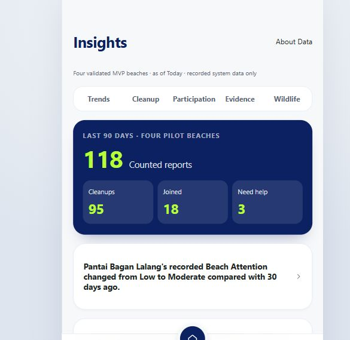
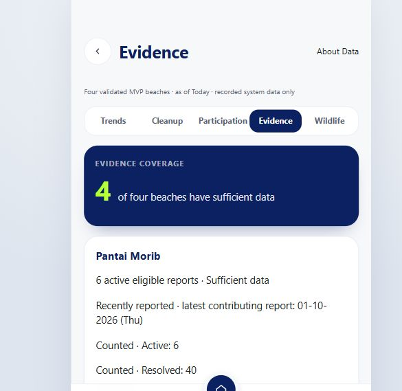
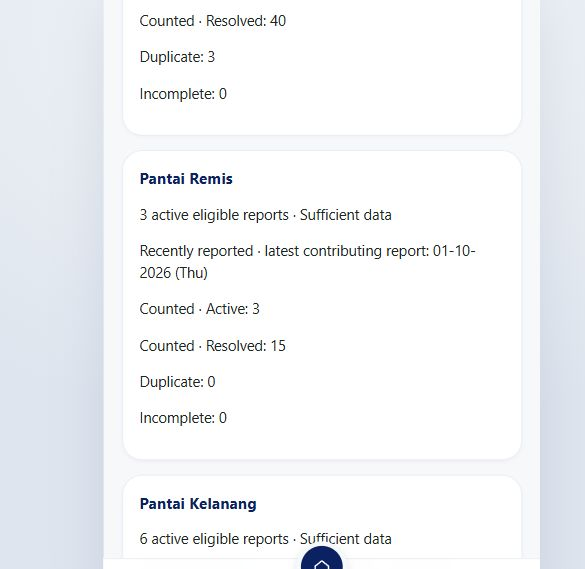
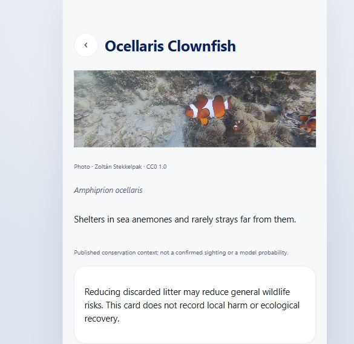
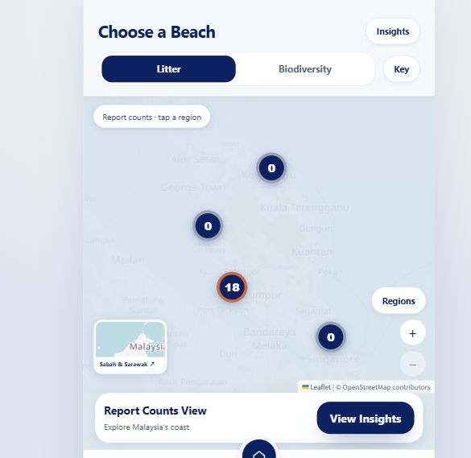

# Iteration 3 test and release record

Test window: 5–6 October 2026 (Asia/Seoul). This document records observed results, repaired failures and release verification. Production checks are recorded separately from local database tests.

## Scope and tested baseline

- Repository: `huangguan-giegie/radar_sampah`.
- Frontend baseline: merged PR [#53](https://github.com/huangguan-giegie/radar_sampah/pull/53), commit `6fcba3b112945d86b4146d27faba35028152e583` on `iteration3`.
- Requirements: Part C of the supplied [acceptance document](https://docs.google.com/document/d/1JNCNzTpXhb4zT0J2NJM1D5ifM5AfYT-e/edit), including the expanded beach dataset.
- Development branch: `codex/iteration3-backend-20261005`, in an isolated worktree. Existing uncommitted work in the original checkout was preserved.
- Local environment: Windows, Python/pytest, Flask/SQLAlchemy, SQLite test databases, Node/npm, Vitest, TypeScript and Vite production build.
- Deployment environment: existing Render API and static frontend services in the confirmed My Workspace. Both deploy from `main`; no additional paid service was created.

## Recorded test rounds

| Round | Observed result | Purpose and outcome |
| --- | --- | --- |
| Baseline | 149 backend tests passed; 195 frontend tests passed; production build passed | Established that the merged frontend and existing backend ran before new implementation. |
| First integrated backend run | 225 passed, 3 failed, out of 228 | Detected legacy SQLite coordinate nullability, attendance accounting and an old four-beach-only scheduler test assumption. These failures were investigated and repaired. |
| Database and acceptance retest | 7 tests passed; independent extended migration retest: 8 passed | Verified legacy database preservation, idempotent restart, missing-coordinate reporting, private profile persistence and the combined participant journey. |
| Backend regression round | 237 passed in 225.63 seconds | Full suite after the migration and attendance fixes. |
| Independent backend regression round | 237 passed in 221.98 seconds | Separate reviewer reran the full suite and acceptance journeys. |
| Frontend integration rounds | 208 passed, then 217 passed in 34 files; production builds passed | Verified real API connections, loading/error states, consent changes, recurrence output and Insights content. |
| Wildlife and recommendation final focused round | 27 backend tests and 24 related frontend tests passed; production build passed | Covered priority order, privacy, prepared-answer fallback, cleanup calculations, check-in guidance and concurrent aggregate refreshes. |
| Final coordinate regression | Initially 1 failed and 1 passed | A missing-coordinate beach was incorrectly used as a suggested map centre. The failing regression drove null guards in confirmation, prediction, mock lookup and Near Me filtering. Final results are recorded below. |
| Final release backend suite | 241 passed in 212.42 seconds | Includes the final wildlife, personal composition and concurrency regressions. No backend failures remained. |
| Final release frontend suite | 227 passed in 36 files (5.27 seconds); production build passed (2.62 seconds) | Independent QA verified all nullable-coordinate guards and reran Vitest, TypeScript and Vite. No frontend failures remained. |

The earlier failed rounds are retained as test evidence; they are not reported as successful runs. Local raw logs and temporary databases are excluded from source commits.

The source credential-pattern scan found no private-key, GitHub-token, OpenAI-project-key or credential-bearing PostgreSQL URL patterns. `git diff --check` reported no whitespace errors.

## Coverage and concrete checks

| Area | Verified behaviour |
| --- | --- |
| Beach Attention and Insights | Same category weights, quantity bands, maximum report score, median beach score, minimum-three evidence gate and 90-day active window as the existing scoring service. Partial cleanup uses remaining bands; resolved reports stay in history. Historical comparisons apply their date cutoff. Public Insights remains restricted to the four validated MVP beaches. |
| Charts and interpretation | Weighted composition, month grouping, trend comparison, individual cleanup scores, hardest-to-clear categories, handling statuses, evidence states, participation and freshness. Insufficient data is shown explicitly; no cleanliness or ecological recovery is inferred. |
| Public privacy | Recursive response checks reject raw participant/report identifiers, private profiles, exact coordinates, photo keys and report links in aggregate Insights. Small participation counts and revealing percentages/breakdowns are suppressed. |
| Recurrence | First Counted follow-up strictly after a cleanup and before the next cleanup; Malaysia calendar-day boundaries; latest cleanup with no follow-up; provisional median only with enough intervals. Beach, cleanup result and Insights agree. |
| Contributions | One point per Counted report and five per eligible recorded event attendance only when that event has a recorded positive cleanup. Legacy and current attendance are deduplicated. Rejected/incomplete/duplicate evidence does not award report points. Cleanup Score is not a contribution total. |
| Consent and nicknames | Default opt-out, persisted nickname, explicit opt-in, renamed public nickname and consent withdrawal. Withdrawn public rows disappear while private history remains. A failed withdrawal request leaves the UI consistent with stored consent. |
| Identity and persistence | Identity comes from the authenticated token. Cross-user query parameters cannot select another participant. Profile/contribution/personal responses use private no-store headers. Restart/recovery retains preferences. |
| Personal aggregate concurrency | Per-user audit rows remain private; source records are refreshed transactionally. Eight concurrent refreshes and an independent four-thread, 24-request run succeeded without duplicate persistent aggregate rows. PostgreSQL locking/schema SQL compiled; this is not a claim of local PostgreSQL runtime testing. |
| Recommendation rules | Guest fallback and the six authorised priority rules; reasons and links follow the existing action flow. Recommendation delivery does not join an event, submit a report or record a cleanup. Unsupported/insufficient context uses the reviewed fallback. |
| Wildlife | Approved source-labelled cards, photo permission metadata, modelled occurrence boundaries, reviewed prepared answers and incident guidance. A reminder appears only after recorded check-in. Optional explanation paths work without a new AI key. |
| Expanded beaches | Exact supplied 82-row name list, distinct ambiguous names, stable identifiers and four validated core beaches, for 86 total entries. New insufficient-data beach accepts manual reporting/cleanup. Missing coordinates do not create fake pins, prediction requests or proximity acceptance. |
| Database upgrade | SQLite with foreign keys enabled preserves existing beach/report/species rows, custom indexes, triggers and foreign-key integrity. Repeated startup is idempotent. PostgreSQL schema-qualified DDL only relaxes beach-coordinate nullability and adds new tables; existing records are retained. |
| Frontend integration | Home recommendations, private account history/leaderboard preferences, Insights topics, recurrence results, species introductions and wildlife guidance use the real API in live mode. Loading, failure/retry and insufficient states are tested. TypeScript and production compilation are included. |

## Combined acceptance journey

The independent API journey records at least three attendances, creates another participant, sets a public nickname and opts in, submits a Counted report, records an event-linked cleanup and confirms six contribution points. It then adds a Counted follow-up two days after cleanup, checks matching recurrence on beach and Insights responses, renames the participant, withdraws consent and confirms that private history is retained. Separate cases cover private identity abuse, suppressed public counts, missing coordinates and legacy database migration.

## Repaired issues

1. Existing SQLite databases had non-null beach coordinates. The in-place table upgrade now permits unknown coordinates while preserving references, indexes, triggers and the foreign-key setting.
2. Historical recorded attendance was omitted from contributions. Current and legacy attendance are now combined and deduplicated, with the recorded-cleanup eligibility gate retained.
3. Old tests assumed only four seeded beaches. They now check the four core entries and the 82 additional rows separately; they do not require new beaches with insufficient evidence to generate weekly events.
4. Frontend coordinate types and several location flows assumed every beach was geocoded. Nullable types and coordinate guards prevent invalid map centres, distance calculations and species predictions.
5. Personal aggregate refreshes could race. Refreshes are now serialised for the same owner within the database transaction.
6. Personal remaining composition initially omitted categories unchanged by one cleanup. The calculation now reuses the actual current band state, including prior relevant cleanups.

## Release and production verification

The release was integrated through [PR #54](https://github.com/huangguan-giegie/radar_sampah/pull/54) into `iteration3`, then [PR #55](https://github.com/huangguan-giegie/radar_sampah/pull/55) into `main`. Implementation commit: `975ff5e`; tested source tree plus unchanged main merge: `b5c2072e0469aa11a706fa9d7242f04f8abf77fb`. Main application release: `3563497ff6c417dab0cfce5386b9265295ec1f9d`. Git comparison confirmed identical source content between the tested tree, merged `iteration3` and the release on `main`.

Rollback tags were pushed before main changed:

- `release/pre-iteration3-main-20261006` → `d7b57519b145a96305f639a264c8c25cac347ab6`.
- `release/pre-iteration3-api-20261006` → `368212375a25b3443ac002e7526a657dca2e35f2`.

| Render service | Release deployment | Observed result |
| --- | --- | --- |
| API, `srv-d9v00r3ncjis73amjvi0` | `dep-db1td9btqb8s739qc510` | Live at 6 October 2026, 01:59:31 KST, on release commit `3563497`. |
| Frontend, `srv-d9v01afqj5pc738lpi5g` | `dep-db1td9btqb8s739qc4ug` | Live at 6 October 2026, 01:56:39 KST, on release commit `3563497`. |

Live addresses: [frontend](https://team04-marine-observation-frontend.onrender.com) and [API health](https://team04-marine-observation-api.onrender.com/health). The deployments were confirmed live before final checks.

The pre-release health request exceeded 90 seconds while waking the old service; the next beach request returned the four original records. After the release went live, health returned HTTP 200 and catalogue requests returned 86 unique records, including exactly four validated core beaches and 78 entries without coordinates.

Production checks cover the public summary and five topic endpoints, recursive privacy assertions, empty recurrence on a beach without cleanup, species cards and prepared questions, wildlife guidance/risk mappings, recommendations, leaderboard response fields, private endpoint HTTP 401 responses and CORS preflight. Private checks create only opted-out empty smoke participants, patch a nickname, restore with a recovery token, reread the persisted profile, verify zero contributions and the private empty-insight response, reject another-user selection with HTTP 400, and clear the smoke nickname. No report, event join, attendance or cleanup is inserted into production; no authentication material is recorded in this document.

The initial smoke harness contained three incorrect assumptions, which were corrected without application changes: no-cleanup recurrence legitimately returns JSON null; a timestamp nickname is correctly rejected as phone-like private data; and Vite places the API configuration and Insights/personal-insight paths in separate chunks. The final bundle check follows the actual compiled asset references and checks the API, Insights and Map chunks.

Browser checks confirmed the real map, Insights overview, evidence status counts, a separate biodiversity panel, species introduction with photo/source credits, a sourced prepared answer, and the live Account contribution display. The checked browser session reported no console warnings or errors. Public overview values observed during this check were 118 Counted reports and 95 recorded cleanups; these were existing system records, not smoke fixtures.

Final production smoke result: **PASS**, all 32 API requests returned their expected status, including the deliberate HTTP 401/400 cases. Health, all topic endpoints, source content, profile write/recovery/read, zero private contributions, consent privacy and actual compiled frontend chunks passed. A filtered Render log query was temporarily unavailable with a provider 502/503; deployment status and successful live endpoint/browser checks are independent evidence of runtime behaviour.

## Live screenshots

Captured from the deployed frontend on 6 October 2026, after release `3563497` was confirmed live. These are actual browser captures, not design previews. Account identifiers and recovery credentials are excluded.

### Insights overview

The overview reads the four validated beaches and existing recorded system data. The limitation wording remains visible.



### Evidence and freshness

The four evidence states and latest contributing dates are shown for each MVP beach. Counted evidence is explicitly distinguished from expert verification.





### Species introduction and sourced answer

The species guide shows the scientific name, photo licence, reviewed sources and a prepared answer. It does not turn general literature into a claim of local harm.




### Live map

The map displays only source-backed locations; missing coordinates do not create invented pins. The 82-name catalogue and its remaining coordinate gap are documented below.



## Data boundary and remaining evidence

The supplied [82-beach CSV](https://drive.google.com/file/d/14SaJV_6mz6nvKhZuhNI6hDyk28JPOxUK/view) contains names only. Four unambiguous matches use source-labelled coordinates already in the catalogue; 78 new entries lack verified coordinates. Individual regions and water types are also absent where the source does not supply them. Those entries are supported in lists and manual reporting, but cannot yet receive GPS map pins or proximity check-in. Full AC4.4.4 location enrichment remains incomplete; passing tests do not resolve that source-data gap.

Local database tests use SQLite. PostgreSQL SQL compilation is an additional review check, not a substitute for deployment startup and live database-backed endpoint verification. No new optional AI provider was configured; approved templates and prepared answers are the release fallback.

## Reproduction

From `actual-project/backend`:

```powershell
python -X utf8 -m pytest tests -q --tb=short --basetemp .pytest-release-retest
```

From `actual-project/frontend`:

```powershell
npm test
npm run build
```

Use a new workspace-local pytest temporary directory for each run on Windows. Never reuse a production database for automated fixture tests.
